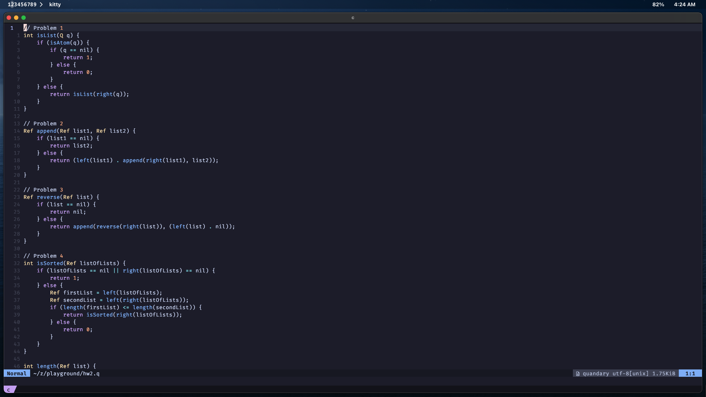
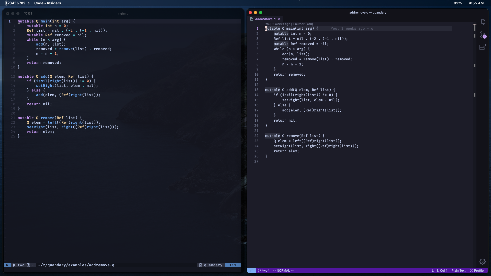

# Quandary Language Support for Neovim

A Neovim plugin that provides language support for [Quandary](https://github.com/mdbond/Quandary-Public), a functional + imperative programming language used to teach Ohio State's [CSE 3341: Principles of Programming Languages](https://syllabi.engineering.osu.edu/syllabi/cse_3341).

## Features

- Syntax highlighting for Quandary files (`.q` and `.qet` extensions)
- Automatic filetype detection
- Basic language configuration (comments, formatting)

## Installation

### Using [LazyNvim](https://github.com/folke/lazy.nvim):

```lua
{
  "5brian/quandary.nvim",
  ft = {"quandary"},
  config = true,
}
```

### Using [packer.nvim](https://github.com/wbthomason/packer.nvim)

```lua
use '5brian/quandary.nvim'
```

### Using [vim-plug](https://github.com/junegunn/vim-plug)

```vim
Plug '5brian/quandary.nvim'
```

## Screenshots
### Quandary Syntax Highlighting

### Quandary Syntax Highlighting in Neovim vs Plain Text in VSCode


